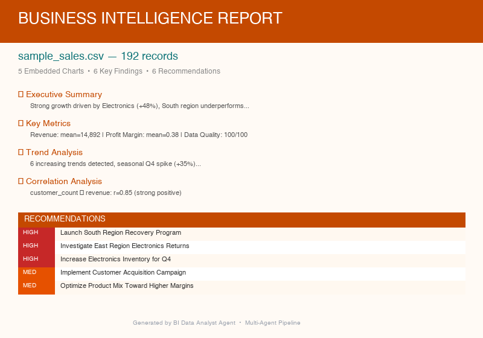

# BI Data Analyst Agent

An AI-powered multi-agent system that transforms raw business data (CSV/Excel) into comprehensive intelligence reports with embedded charts, statistical analysis, and actionable recommendations.

---

## Architecture

```
CSV / Excel Input
       │
       ▼
┌──────────────────────────┐
│      Orchestrator         │  Coordinates 5-phase pipeline
└──────┬───────────────────┘
       │
  ┌────┼──────────┬────────────┐
  ▼    ▼          ▼            ▼
┌─────┐┌────────┐┌───────────┐┌──────────┐
│Data ││Pattern ││Visuali-   ││Insight   │
│Load-││Agent   ││zation     ││Agent     │
│er   ││        ││Agent      ││  (AI)    │
│     ││(pandas)││(matplotlib)││(Anthropic│
│     ││        ││           ││   API)   │
└──┬──┘└──┬─────┘└─────┬─────┘└────┬─────┘
   │      │            │           │
   └──────┴────────────┴───────────┘
                  │
                  ▼
        ┌─────────────────┐
        │ Report Generator │ → DOCX with Charts
        └─────────────────┘
```

| Agent | Role | Technology |
|-------|------|-----------|
| **DataLoaderAgent** | Reads CSV/Excel, validates data, computes statistics | pandas, Pydantic |
| **PatternAgent** | Detects trends, correlations, outliers, seasonality | pandas, numpy, z-score |
| **VisualizationAgent** | Creates line, bar, pie, heatmap, scatter charts | matplotlib |
| **InsightAgent** | Generates AI-powered findings and recommendations | Anthropic API, structured outputs |
| **ReportGenerator** | Builds DOCX with embedded charts and tables | python-docx |

> **Design note:** 3 of 4 agents are pure Python (no API calls). Only the InsightAgent uses the AI API — demonstrating that effective agent architectures combine deterministic computation with AI where it adds the most value.

---

## Quickstart

```bash
# 1. Clone the repo
git clone https://github.com/eugengoebel/bi-data-analyst.git
cd bi-data-analyst

# 2. Install dependencies
pip install -r requirements.txt

# 3a. Test without an API key (uses sample data + mock insights)
python main.py --dry-run

# 3b. Analyze your own data with Anthropic API
echo "ANTHROPIC_API_KEY=sk-ant-..." > .env
python main.py your_data.csv
python main.py quarterly_sales.xlsx --output ./reports
```

The report is saved to `./output/bi_report_<filename>_<date>.docx`.

---

## Testing

```bash
# Run the full test suite (78 tests, no API key needed)
python -m pytest tests/ -v
```

The test suite covers:
- **Model validation** — All 12 Pydantic models, Literal constraints, serialization
- **Data loading** — CSV reading, date detection, quality scoring, error handling
- **Pattern detection** — Trend analysis, correlation finding, outlier detection
- **Visualization** — Chart generation, PNG output, file validation
- **AI agent logic** — Mocked API client, structured output verification
- **Report generation** — DOCX output, section presence, embedded images, tables
- **CLI integration** — Dry-run mode, error handling, argument parsing

---

## Example Output

Running `python main.py --dry-run` produces a ~12-page report with 5 embedded charts:

<p align="center">
  
</p>

---

## Project Structure

```
bi-data-analyst/
├── main.py                        # CLI entry point (supports --dry-run)
├── agents/
│   ├── data_loader.py             # CSV/Excel loading + data profiling
│   ├── pattern_agent.py           # Trend, correlation, outlier detection
│   ├── visualization_agent.py     # matplotlib chart generation
│   ├── insight_agent.py           # AI-powered recommendations
│   ├── orchestrator.py            # 5-phase pipeline coordinator
│   └── mock_data.py               # Mock InsightResult for --dry-run
├── utils/
│   └── report_generator.py        # DOCX with embedded charts
├── data/
│   └── sample_sales.csv           # 192-row sample dataset
├── tests/
│   ├── test_models.py             # Pydantic model tests (15 tests)
│   ├── test_data_loader.py        # Data loading tests (11 tests)
│   ├── test_pattern_agent.py      # Pattern detection tests (8 tests)
│   ├── test_visualization.py      # Chart generation tests (8 tests)
│   ├── test_agents.py             # AI agent tests, mocked API (8 tests)
│   ├── test_report_generator.py   # DOCX generation tests (12 tests)
│   └── test_cli.py                # CLI integration tests (6 tests)
├── output/                        # Generated reports (git-ignored)
├── requirements.txt
└── .env.example
```

---

## Tech Stack

| Component | Technology |
|-----------|-----------|
| Data Processing | pandas, numpy |
| Visualization | matplotlib (Agg backend) |
| AI Backend | Anthropic API (claude-opus-4-6) |
| Structured Outputs | Pydantic v2 + `messages.parse()` |
| Report Generation | python-docx with `add_picture()` for chart embedding |
| Excel Support | openpyxl |
| Testing | pytest (78 tests) |

---

## Report Sections

1. **Cover Page** — Dataset name, record count, quality score, date
2. **Executive Summary** — AI-generated overview of business performance
3. **Data Overview** — Row/column counts, date range, quality metrics
4. **Key Metrics Summary** — Descriptive statistics table (mean, median, std, min, max)
5. **Trend Analysis** — Detected trends + embedded line chart
6. **Category & Regional Breakdown** — Bar chart + pie chart
7. **Correlation Analysis** — Correlation interpretations + heatmap
8. **Outlier Detection** — Outlier table with z-scores
9. **Key Findings** — AI-generated findings with evidence and implications
10. **Recommendations** — Priority-coded table (High/Medium/Low) with expected impact
11. **Risk Alerts** — Data-driven warnings
12. **Opportunities** — Growth and improvement suggestions
13. **Methodology** — Analysis approach description

---

## Sample Dataset

The included `data/sample_sales.csv` contains 192 rows of realistic sales data with intentional patterns:

| Pattern | Description |
|---------|------------|
| Electronics Growth | +48% revenue increase over 12 months |
| South Underperformance | ~25% below company average across all categories |
| Q4 Seasonal Spike | ~35% revenue increase in October–December |
| Returns Anomaly | 89 returns (vs. avg 5-15) in East/Electronics/July |
| Customer-Revenue Correlation | r ≈ 0.85 between customer count and revenue |

---

## License

MIT License — see [LICENSE](LICENSE)
